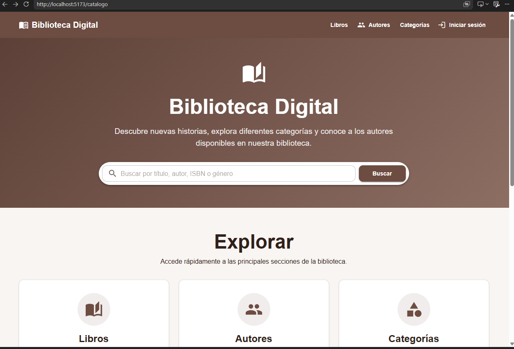
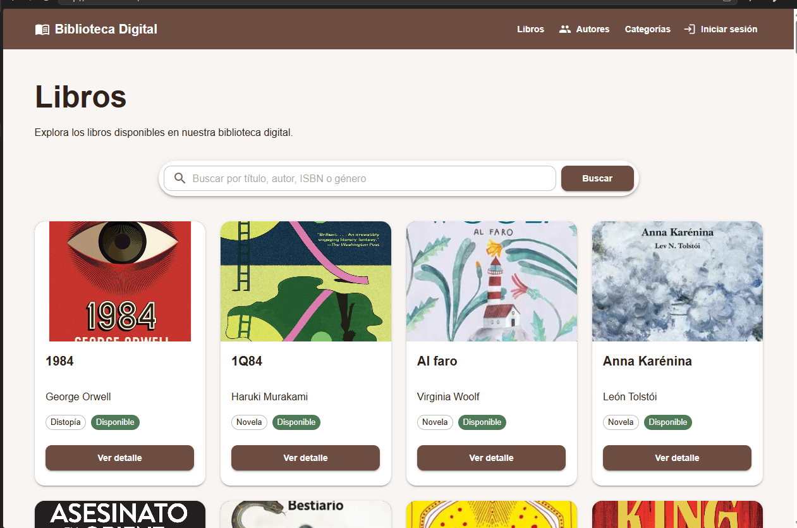
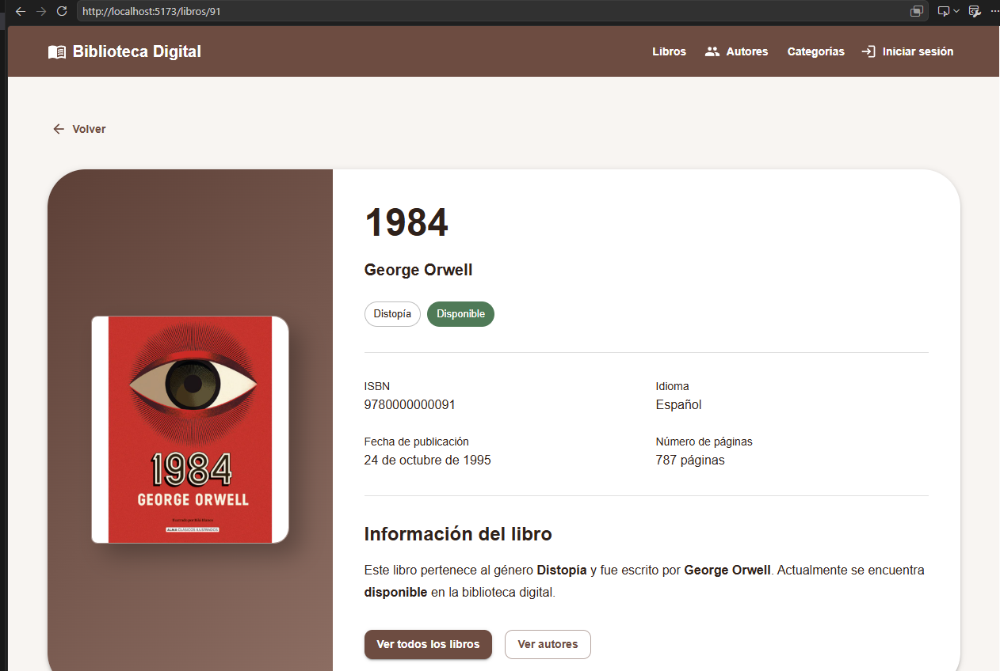
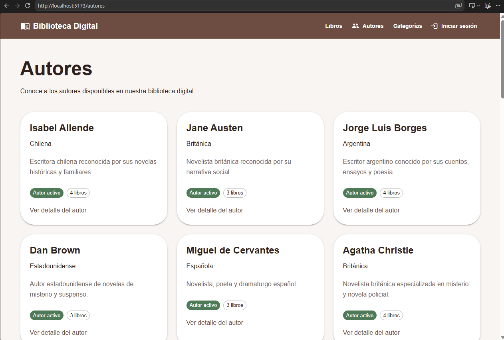
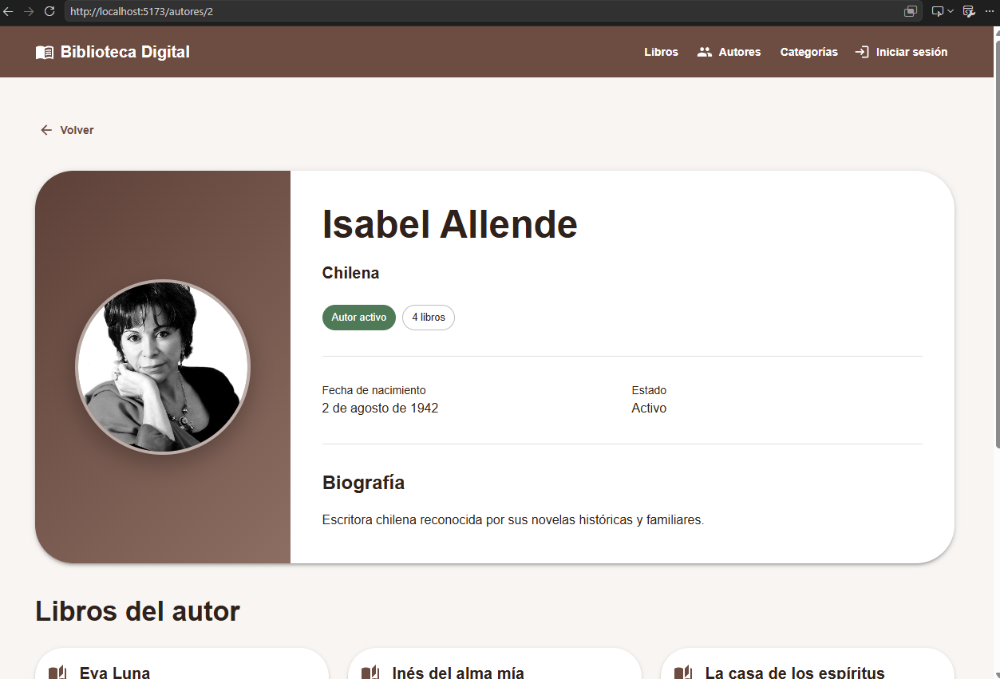
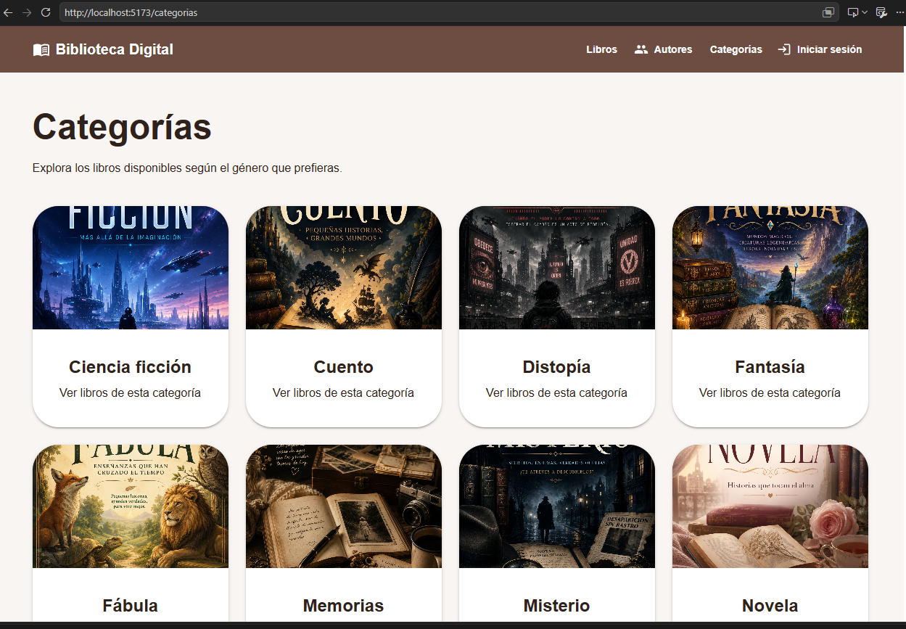
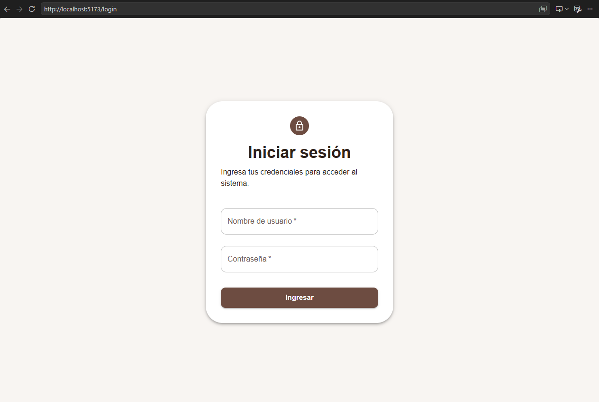
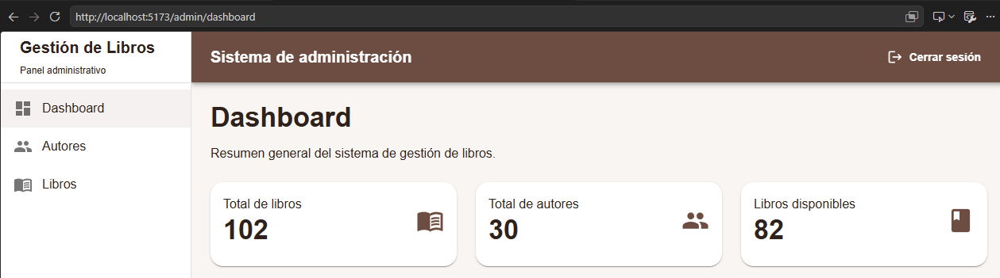
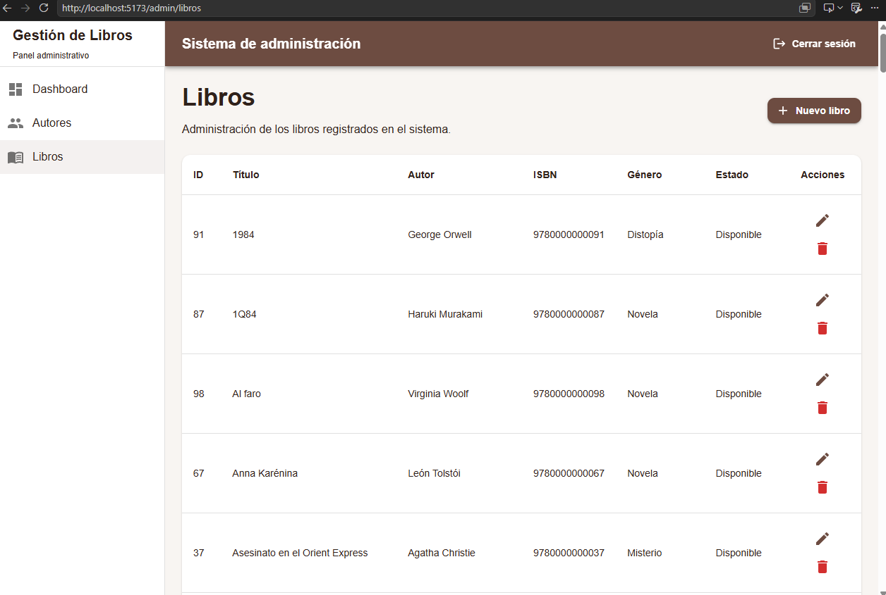
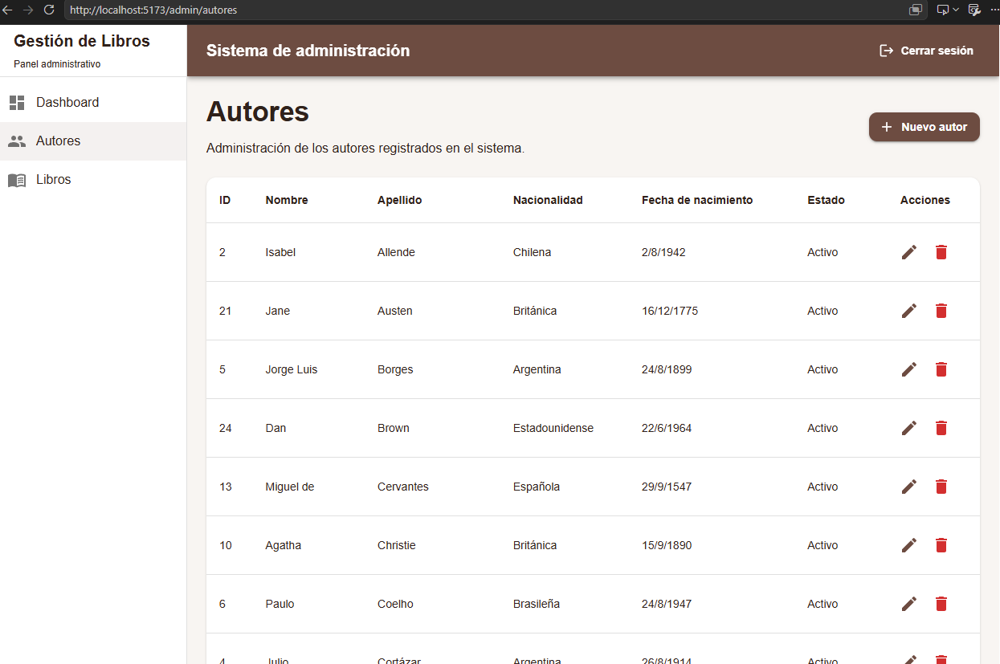

# CAPITULO 1
# Sistema de Gestión de Libros
## Frontend


---

# Descripción

El Frontend corresponde a la interfaz gráfica del Sistema de Gestión de Libros, desarrollada utilizando React y Vite.

Su principal objetivo es ofrecer una experiencia moderna, intuitiva y responsiva para la administración y consulta de información bibliográfica, consumiendo los servicios REST proporcionados por el Backend desarrollado con Django REST Framework.

La aplicación fue construida bajo una arquitectura basada en componentes reutilizables, permitiendo separar claramente la lógica de negocio, la navegación, la autenticación y la presentación de la información.

Entre sus funcionalidades principales se encuentran:

- Consulta pública del catálogo de libros.
- Consulta pública de autores.
- Navegación por categorías.
- Visualización del detalle de libros y autores.
- Inicio de sesión mediante OAuth2.
- Panel administrativo protegido.
- Administración de autores.
- Administración de libros.
- Gestión de imágenes.
- Integración completa con la API REST.

---

# Objetivo General

Desarrollar una aplicación web moderna utilizando React que permita consumir los servicios REST del Backend para administrar y consultar un catálogo de libros mediante una interfaz intuitiva, segura y responsiva.

---

# Objetivos Específicos

- Implementar una interfaz moderna utilizando React.
- Consumir la API REST mediante Axios.
- Implementar autenticación utilizando OAuth2.
- Proteger las rutas administrativas.
- Desarrollar componentes reutilizables.
- Mostrar información dinámica proveniente del Backend.
- Gestionar imágenes de autores, libros y categorías.
- Aplicar buenas prácticas de organización del código.

---

# Alcance

El Frontend permite diferenciar dos tipos de usuarios:

## Visitantes

Los visitantes pueden acceder libremente a:

- Página principal.
- Catálogo de libros.
- Autores.
- Categorías.
- Detalle de libros.
- Detalle de autores.

---

## Usuarios autenticados

Después del inicio de sesión los usuarios pueden acceder al panel administrativo para:

- Registrar autores.
- Editar autores.
- Eliminar autores.
- Registrar libros.
- Editar libros.
- Eliminar libros.
- Gestionar imágenes.

# CAPITULO 2

# Tecnologías Utilizadas

El Frontend del Sistema de Gestión de Libros fue desarrollado utilizando tecnologías modernas del ecosistema JavaScript, con el objetivo de construir una interfaz rápida, escalable y fácil de mantener.

Las herramientas seleccionadas permiten una integración eficiente con la API REST desarrollada en Django REST Framework.

## React

React fue utilizado como biblioteca principal para la construcción de la interfaz de usuario.

Su modelo basado en componentes permitió desarrollar una aplicación modular, reutilizable y sencilla de mantener.

Entre las principales ventajas obtenidas se encuentran:

- Reutilización de componentes.
- Actualización eficiente del DOM.
- Separación de responsabilidades.
- Desarrollo basado en componentes.

---

## Vite

El proyecto fue creado utilizando Vite como herramienta de construcción.

Vite proporciona un entorno de desarrollo moderno caracterizado por:

- Inicio extremadamente rápido.
- Recarga automática (Hot Reload).
- Compilación optimizada.
- Excelente rendimiento durante el desarrollo.

---

## Material UI

La interfaz gráfica fue desarrollada utilizando Material UI.

Esta biblioteca permitió implementar una apariencia moderna y consistente mediante componentes prediseñados como:

- AppBar
- Drawer
- Buttons
- Cards
- Dialogs
- Tables
- Typography
- Grid
- Icons

El uso de Material UI redujo significativamente el tiempo de desarrollo y mejoró la experiencia del usuario.

---

## React Router

La navegación entre las diferentes páginas se implementó utilizando React Router.

Esta biblioteca permitió construir una aplicación SPA (Single Page Application), evitando la recarga completa del navegador durante la navegación.

Entre las rutas implementadas se encuentran:

- Página principal.
- Login.
- Catálogo.
- Autores.
- Categorías.
- Dashboard.
- Administración de libros.
- Administración de autores.
- Detalle de autores.
- Detalle de libros.

---

## Axios

La comunicación entre el Frontend y el Backend se implementó mediante Axios.

Todos los servicios consumen la API REST utilizando solicitudes HTTP.

Las principales operaciones implementadas fueron:

- GET
- POST
- PUT
- PATCH
- DELETE

La configuración centralizada del cliente Axios facilita el mantenimiento y reutilización del código.

---

## Context API

La administración del estado de autenticación se implementó mediante React Context.

El proyecto incorpora un contexto denominado:

```
AuthContext
```

Este contexto administra:

- Usuario autenticado.
- Token OAuth2.
- Inicio de sesión.
- Cierre de sesión.
- Persistencia de la sesión.

Gracias a esta implementación se evita el envío innecesario de propiedades entre componentes.

---

## JavaScript ES6+

El desarrollo utiliza las características modernas del lenguaje JavaScript.

Entre ellas:

- Arrow Functions.
- Async/Await.
- Modules.
- Destructuring.
- Template Strings.
- Optional Chaining.

Estas características permiten escribir código más limpio y mantenible.

---

# Arquitectura del Frontend

La aplicación sigue una arquitectura modular basada en componentes reutilizables.

Cada módulo posee una responsabilidad claramente definida, facilitando el mantenimiento y futuras ampliaciones.

La estructura general puede resumirse de la siguiente manera:

```
Usuario

↓

React

↓

React Router

↓

Pages

↓

Components

↓

Services

↓

Axios

↓

API REST (Django)

↓

SQLite
```

---

# Organización General del Proyecto

El proyecto fue organizado siguiendo una estructura por responsabilidades.

```
src/

│

├── components/

├── pages/

├── routes/

├── layouts/

├── context/

├── services/

├── styles/

├── App.jsx

└── main.jsx
```

Cada carpeta concentra una responsabilidad específica, evitando la duplicación de código y facilitando la reutilización de componentes.

---

# Flujo General de Funcionamiento

El funcionamiento del Frontend sigue el siguiente proceso:

1. El usuario accede a una página del sistema.

2. React Router determina qué componente debe mostrarse.

3. La página solicita información mediante los servicios correspondientes.

4. Axios realiza la petición HTTP al Backend.

5. Django procesa la solicitud.

6. El Backend devuelve una respuesta JSON.

7. React actualiza automáticamente la interfaz del usuario.

Este flujo permite mantener completamente desacopladas la interfaz gráfica y la lógica de negocio implementada en el servidor.

---

# Integración con el Backend

Toda la información mostrada en la interfaz es obtenida desde la API REST desarrollada en Django.

La comunicación se realiza utilizando respuestas JSON y peticiones HTTP.

Entre los recursos consumidos se encuentran:

- Autores.
- Libros.
- Categorías.
- Libros destacados.
- Autenticación OAuth2.

Esta arquitectura permite que el Frontend funcione independientemente del Backend, siempre que la API mantenga los contratos establecidos.

# CAPITULO 3 

# Estructura del Proyecto

El Frontend fue organizado siguiendo una arquitectura modular basada en responsabilidades, lo que facilita el mantenimiento, la escalabilidad y la reutilización del código.

Cada carpeta cumple una función específica dentro de la aplicación, permitiendo mantener una clara separación entre la interfaz gráfica, la navegación, la lógica de negocio y la comunicación con el Backend.

La estructura principal del proyecto es la siguiente:

```text
gestion-libros-frontend/

├── public/
├── src/
│   ├── assets/
│   ├── components/
│   ├── context/
│   ├── layouts/
│   ├── pages/
│   ├── routes/
│   ├── services/
│   ├── styles/
│   ├── App.jsx
│   └── main.jsx
├── package.json
├── vite.config.js
└── index.html
```

---

# Organización de la carpeta `src`

La carpeta `src` contiene todo el código fuente de la aplicación.

Cada subcarpeta fue creada con un propósito específico para mantener el proyecto organizado y facilitar futuras ampliaciones.

---

# Components

La carpeta **components** contiene todos los componentes reutilizables de la aplicación.

Estos componentes representan elementos de interfaz que pueden utilizarse en diferentes páginas sin duplicar código.

Entre ellos se encuentran:

- Header
- PublicHeader
- Sidebar
- LibroCard
- Buscador de libros
- Formularios
- Tablas
- Diálogos
- Componentes específicos para autores y libros

Gracias a esta organización, cada componente posee una única responsabilidad y puede reutilizarse en distintos módulos del sistema.

---

## Header

El componente **Header** representa la barra superior utilizada en el área administrativa.

Entre sus funciones principales se encuentran:

- Mostrar el nombre del sistema.
- Facilitar la navegación.
- Mostrar información del usuario autenticado.
- Permitir el cierre de sesión.

---

## PublicHeader

El componente **PublicHeader** se utiliza en las páginas públicas del sistema.

Proporciona acceso a las principales secciones del catálogo:

- Inicio.
- Catálogo.
- Autores.
- Categorías.
- Inicio de sesión.

Este componente mantiene una apariencia uniforme en toda la navegación pública.

---

## Sidebar

El **Sidebar** corresponde al menú lateral mostrado dentro del Dashboard.

Permite acceder rápidamente a las diferentes opciones administrativas, tales como:

- Gestión de autores.
- Gestión de libros.
- Panel principal.

Su implementación mejora la experiencia del usuario al facilitar la navegación entre módulos.

---

## Componentes de Libros

Dentro del directorio correspondiente a libros se encuentran componentes especializados para:

- Mostrar tarjetas de libros.
- Formularios de registro y edición.
- Listados.
- Visualización de información detallada.

Estos componentes encapsulan toda la lógica relacionada con la presentación de libros.

---

## Componentes de Autores

Los componentes destinados a autores administran la visualización y edición de la información correspondiente.

Entre sus funciones destacan:

- Formularios.
- Tablas.
- Tarjetas.
- Visualización de detalles.

Esta separación permite mantener independiente la lógica de autores respecto al resto de módulos.

---

# Pages

La carpeta **pages** agrupa las páginas principales de la aplicación.

Cada página representa una vista completa accesible mediante una ruta del sistema.

Entre las páginas implementadas se encuentran:

- HomePage
- LoginPage
- CatalogoPage
- LibrosPublicPage
- LibroDetallePage
- AutoresPublicPage
- AutorDetallePage
- CategoriasPage
- DashboardPage
- LibrosPage
- AutoresPage

Cada una consume la información necesaria mediante los servicios definidos en la aplicación.

---

## HomePage

Corresponde a la página principal del sistema.

Desde esta vista el usuario puede acceder al catálogo y conocer los libros destacados publicados por la API.

---

## CatalogoPage

Presenta el catálogo completo de libros disponibles.

Permite visualizar la información general de cada libro mediante tarjetas y acceder posteriormente a su detalle.

---

## LibrosPublicPage

Esta vista muestra únicamente la información pública relacionada con los libros.

Su contenido puede consultarse sin necesidad de autenticación.

---

## LibroDetallePage

Permite visualizar toda la información correspondiente a un libro específico.

Entre los datos mostrados se incluyen:

- Título.
- Autor.
- Género.
- Idioma.
- Número de páginas.
- Fecha de publicación.
- Portada.

---

## AutoresPublicPage

Presenta el listado público de autores registrados en el sistema.

Cada autor puede consultarse individualmente mediante su página de detalle.

---

## AutorDetallePage

Muestra toda la información correspondiente a un autor.

Además de sus datos personales, incluye los libros asociados registrados en el sistema.

---

## CategoriasPage

Permite consultar las categorías disponibles y navegar por el catálogo de forma organizada.

La información es obtenida dinámicamente desde la API REST.

---

## DashboardPage

Constituye el panel principal del área administrativa.

Desde esta página el usuario autenticado puede acceder a las diferentes funcionalidades de administración.

---

## LibrosPage

Corresponde al módulo administrativo encargado de gestionar los libros.

Permite realizar operaciones CRUD mediante formularios y tablas.

---

## AutoresPage

Permite administrar toda la información relacionada con los autores registrados.

Incluye funcionalidades para:

- Registrar.
- Editar.
- Eliminar.
- Consultar.

---

# Routes

La carpeta **routes** administra toda la navegación del sistema.

La aplicación utiliza React Router para definir las rutas públicas y privadas.

Entre sus principales componentes destacan:

- AppRouter
- ProtectedRoute

---

## AppRouter

Centraliza la definición de todas las rutas de la aplicación.

Desde este componente se determina qué página debe mostrarse según la URL solicitada por el usuario.

---

## ProtectedRoute

Este componente protege las rutas administrativas.

Antes de permitir el acceso verifica que el usuario se encuentre autenticado.

Si el usuario no posee un token válido, es redirigido automáticamente a la página de inicio de sesión.

---

# Layouts

La carpeta **layouts** contiene las estructuras visuales compartidas entre varias páginas.

El principal layout implementado es:

## DashboardLayout

Este layout organiza la interfaz administrativa incorporando:

- Header.
- Sidebar.
- Área principal de contenido.

Gracias a esta estructura todas las páginas administrativas mantienen una apariencia uniforme.

---

# Context

La carpeta **context** contiene la implementación de React Context utilizada para administrar el estado global de autenticación.

## AuthContext

El contexto de autenticación administra:

- Usuario autenticado.
- Token OAuth2.
- Inicio de sesión.
- Cierre de sesión.
- Persistencia de la sesión.

Su utilización evita el paso innecesario de propiedades entre componentes.

---

# Services

La carpeta **services** concentra toda la comunicación con el Backend.

Cada entidad posee su propio servicio especializado.

Entre ellos se encuentran:

- api.js
- authService.js
- autorService.js
- libroService.js
- categoriaService.js

Esta organización facilita el mantenimiento y evita repetir código relacionado con solicitudes HTTP.

---

## api.js

Configura la instancia principal de Axios.

Centraliza la URL base de la API y la configuración utilizada por el resto de servicios.

---

## authService.js

Implementa la comunicación con los endpoints de autenticación.

Administra el proceso de inicio de sesión y obtención del Access Token.

---

## autorService.js

Contiene todas las operaciones relacionadas con los autores.

Entre ellas:

- Consultar autores.
- Registrar.
- Actualizar.
- Eliminar.

---

## libroService.js

Implementa todas las operaciones CRUD correspondientes al módulo de libros.

Además permite consultar los libros destacados y el detalle individual de cada registro.

---

## categoriaService.js

Obtiene las categorías disponibles desde la API para su visualización en la interfaz pública.

---

# Styles

La carpeta **styles** contiene la configuración visual de la aplicación.

Dentro de ella se encuentra la definición del tema utilizado por Material UI, permitiendo mantener una apariencia consistente en todos los componentes.

---

# Archivo App.jsx

`App.jsx` representa el componente raíz de la aplicación.

Desde este punto se integra el sistema de rutas y se inicializa la estructura principal del Frontend.

---

# Archivo main.jsx

`main.jsx` constituye el punto de entrada de la aplicación React.

Sus responsabilidades principales son:

- Inicializar React.
- Renderizar el componente principal.
- Configurar los proveedores globales.
- Montar la aplicación sobre el elemento raíz del documento HTML.

# CAPITULO 4 

# Arquitectura Funcional del Frontend

El Frontend del Sistema de Gestión de Libros fue desarrollado siguiendo una arquitectura basada en componentes reutilizables y una navegación controlada mediante React Router.

La aplicación separa claramente la lógica de presentación, autenticación, navegación y comunicación con el Backend, permitiendo mantener un código organizado, escalable y fácil de mantener.

Los principales módulos que conforman la arquitectura son:

- Sistema de rutas.
- Protección de páginas.
- Layout administrativo.
- Contexto de autenticación.
- Componentes reutilizables.
- Servicios para consumo de la API.

---

# Sistema de Navegación

La navegación de la aplicación fue implementada mediante **React Router**, permitiendo construir una Single Page Application (SPA).

Gracias a este enfoque, la transición entre páginas ocurre sin recargar completamente el navegador, mejorando la experiencia del usuario.

El sistema diferencia claramente entre:

- Rutas públicas.
- Rutas protegidas.

---

# AppRouter

El archivo **AppRouter.jsx** constituye el núcleo de la navegación.

Su responsabilidad consiste en definir todas las rutas disponibles dentro de la aplicación y asociarlas con la página correspondiente.

Entre las rutas implementadas se encuentran:

## Rutas Públicas

- Inicio.
- Catálogo.
- Libros.
- Autores.
- Categorías.
- Detalle de libros.
- Detalle de autores.
- Inicio de sesión.

Estas rutas pueden ser consultadas por cualquier visitante sin necesidad de autenticarse.

---

## Rutas Protegidas

Las rutas administrativas únicamente pueden ser utilizadas por usuarios autenticados.

Entre ellas se encuentran:

- Dashboard.
- Administración de autores.
- Administración de libros.

Estas páginas son protegidas mediante el componente `ProtectedRoute`.

---

# ProtectedRoute

El componente **ProtectedRoute** controla el acceso a las páginas privadas del sistema.

Antes de renderizar una página protegida verifica que el usuario posea una sesión válida.

El funcionamiento general es el siguiente:

1. El usuario intenta acceder a una ruta protegida.
2. El componente consulta el estado del `AuthContext`.
3. Si existe un token válido, permite el acceso.
4. Si el usuario no está autenticado, redirige automáticamente a la página de inicio de sesión.

Esta estrategia evita que usuarios no autorizados accedan a funciones administrativas.

---

# DashboardLayout

Las páginas administrativas comparten una misma estructura visual.

Para evitar duplicar código se implementó el componente **DashboardLayout**.

Este layout organiza la interfaz mediante tres secciones principales:

## Header

Ubicado en la parte superior.

Contiene:

- Nombre del sistema.
- Información del usuario.
- Acciones de sesión.

---

## Sidebar

Ubicado en el lateral izquierdo.

Incluye el menú principal para acceder a:

- Dashboard.
- Libros.
- Autores.

Gracias a este menú la navegación resulta rápida e intuitiva.

---

## Área de Contenido

La parte central del Dashboard muestra dinámicamente el contenido correspondiente a cada módulo administrativo.

Cada página es renderizada dentro del mismo layout, manteniendo una apariencia uniforme en toda la aplicación.

---

# Sistema de Autenticación

El Frontend administra la autenticación utilizando React Context.

Toda la información relacionada con la sesión se encuentra centralizada en el componente:

```
AuthContext
```

Este contexto evita compartir manualmente información entre componentes y facilita el acceso al usuario autenticado desde cualquier parte de la aplicación.

---

# AuthContext

El contexto de autenticación administra toda la información relacionada con la sesión del usuario.

Entre sus responsabilidades principales se encuentran:

- Mantener el usuario autenticado.
- Almacenar el Access Token.
- Permitir iniciar sesión.
- Permitir cerrar sesión.
- Compartir el estado de autenticación con toda la aplicación.

De esta manera cualquier componente puede conocer si el usuario ha iniciado sesión sin necesidad de realizar consultas adicionales.

---

# Flujo de Autenticación

El proceso de autenticación implementado sigue el siguiente flujo:

1. El usuario accede a la página de inicio de sesión.

2. Ingresa sus credenciales.

3. El Frontend envía la solicitud al Backend mediante Axios.

4. Django OAuth2 valida las credenciales.

5. El Backend devuelve un Access Token.

6. El Frontend almacena el token.

7. El usuario obtiene acceso al Dashboard.

8. Todas las solicitudes protegidas incluyen automáticamente el token de autenticación.

Este mecanismo garantiza que únicamente los usuarios autorizados puedan modificar la información del sistema.

---

# Componentes Reutilizables

Uno de los principios utilizados durante el desarrollo fue la reutilización de componentes.

Esta estrategia reduce considerablemente la duplicación de código y facilita el mantenimiento del proyecto.

Entre los principales componentes reutilizables implementados se encuentran:

- Header.
- PublicHeader.
- Sidebar.
- LibroCard.
- Buscador de libros.
- Formularios.
- Tablas.
- Diálogos.

Cada componente posee una única responsabilidad, siguiendo buenas prácticas de desarrollo.

---

# Header

El Header se utiliza dentro del Dashboard.

Su finalidad consiste en mantener visible la información principal del sistema y facilitar la interacción del usuario autenticado.

---

# PublicHeader

El PublicHeader se muestra en todas las páginas públicas.

Permite navegar entre:

- Inicio.
- Catálogo.
- Autores.
- Categorías.
- Inicio de sesión.

Gracias a este componente la navegación mantiene una apariencia uniforme.

---

# LibroCard

El componente LibroCard encapsula la representación visual de cada libro.

Cada tarjeta muestra información resumida como:

- Portada.
- Título.
- Autor.
- Género.

Al seleccionar una tarjeta el usuario puede acceder al detalle completo del libro.

---

# Buscador de Libros

El buscador permite localizar rápidamente libros dentro del catálogo.

Las consultas realizadas por el usuario son enviadas a la API REST mediante los servicios implementados con Axios.

---

# Flujo General del Frontend

El comportamiento general de la aplicación puede resumirse mediante el siguiente proceso:

1. El usuario accede a una página.

2. React Router determina qué componente debe renderizarse.

3. La página solicita información al servicio correspondiente.

4. Axios realiza la petición HTTP al Backend.

5. Django procesa la solicitud.

6. La API devuelve una respuesta JSON.

7. React actualiza automáticamente la interfaz del usuario.

Este flujo mantiene completamente desacopladas la interfaz gráfica y la lógica de negocio del servidor.

---

# Beneficios de la Arquitectura Implementada

La arquitectura utilizada proporciona diversas ventajas:

- Separación clara de responsabilidades.
- Componentes reutilizables.
- Navegación eficiente mediante SPA.
- Integración sencilla con la API REST.
- Fácil mantenimiento.
- Escalabilidad.
- Código organizado.
- Mejor experiencia de usuario.

# CAPITULO 5 

# Capítulo 5. Comunicación con el Backend

El Frontend fue diseñado para consumir los servicios REST proporcionados por el Backend desarrollado en Django REST Framework.

La comunicación entre ambas aplicaciones se realiza mediante solicitudes HTTP utilizando la librería **Axios**, lo que permite mantener completamente desacopladas la interfaz de usuario y la lógica de negocio.

Toda la información mostrada en pantalla es obtenida dinámicamente desde la API REST, evitando almacenar datos estáticos dentro de la aplicación.

---

# Arquitectura de Comunicación

La interacción entre el usuario y el sistema sigue el siguiente flujo:

```
Usuario

↓

Interfaz React

↓

Servicios (Axios)

↓

API REST (Django)

↓

Base de Datos SQLite

↓

Respuesta JSON

↓

Actualización Automática de la Interfaz
```

Esta arquitectura permite mantener una separación clara entre el Frontend y el Backend, facilitando el mantenimiento y la escalabilidad del sistema.

---

# Configuración de Axios

La aplicación utiliza una instancia centralizada de Axios definida en el archivo:

```
src/services/api.js
```

Este archivo concentra la configuración utilizada por todos los servicios de la aplicación.

Entre sus responsabilidades se encuentran:

- Definir la URL base de la API.
- Configurar los encabezados HTTP.
- Centralizar la comunicación con el Backend.
- Facilitar el mantenimiento del proyecto.

Gracias a esta implementación, si la dirección del servidor cambia, únicamente es necesario modificar un único archivo.

---

# Organización de los Servicios

La comunicación con el Backend fue organizada mediante servicios independientes para cada módulo del sistema.

```
services/

│

├── api.js

├── authService.js

├── autorService.js

├── libroService.js

└── categoriaService.js
```

Cada servicio encapsula las operaciones correspondientes a una entidad específica, evitando duplicación de código y facilitando futuras ampliaciones.

---

# Servicio de Autenticación

El archivo:

```
authService.js
```

administra todo el proceso de autenticación del usuario.

Entre sus responsabilidades principales se encuentran:

- Envío de credenciales al Backend.
- Obtención del Access Token.
- Gestión de la sesión.
- Cierre de sesión.

La autenticación fue implementada utilizando OAuth2, garantizando un acceso seguro a las funcionalidades administrativas.

---

# Flujo de Inicio de Sesión

El proceso de autenticación sigue la siguiente secuencia:

1. El usuario ingresa sus credenciales en la página de Login.

2. El Frontend envía una solicitud HTTP al Backend.

3. Django OAuth Toolkit valida las credenciales.

4. El servidor genera un Access Token.

5. El token es almacenado por el Frontend.

6. El usuario obtiene acceso al Dashboard.

7. Las solicitudes protegidas incorporan automáticamente el token de autenticación.

Este flujo garantiza que únicamente los usuarios autorizados puedan acceder a las operaciones de administración.

---

# Servicio de Autores

El archivo:

```
autorService.js
```

concentra todas las operaciones relacionadas con los autores.

Entre las funciones implementadas se encuentran:

- Obtener listado de autores.
- Consultar un autor específico.
- Registrar nuevos autores.
- Actualizar información.
- Eliminar registros.

Cada operación realiza una solicitud HTTP al endpoint correspondiente del Backend.

---

# Servicio de Libros

El archivo:

```
libroService.js
```

administra todas las operaciones correspondientes al catálogo de libros.

Entre ellas destacan:

- Consulta general de libros.
- Consulta de libros destacados.
- Consulta individual.
- Registro.
- Actualización.
- Eliminación.

Además permite recuperar la información necesaria para construir el catálogo mostrado al usuario.

---

# Servicio de Categorías

El archivo:

```
categoriaService.js
```

obtiene las categorías publicadas por el Backend.

Estas categorías son utilizadas para organizar visualmente el catálogo y facilitar la navegación del usuario.

---

# Endpoints Consumidos

El Frontend consume diferentes recursos publicados por la API REST.

| Recurso | Endpoint |
|----------|----------|
| Inicio | `/api/` |
| Autores | `/api/autores/` |
| Libros | `/api/libros/` |
| Libros destacados | `/api/libros/destacados/` |
| Categorías | `/api/categorias/` |
| OAuth2 | `/o/token/` |

Cada uno de estos recursos es consumido mediante Axios utilizando los servicios correspondientes.

---

# Métodos HTTP Utilizados

La comunicación entre Frontend y Backend emplea los métodos HTTP estándar.

| Método | Función |
|---------|----------|
| GET | Consultar información |
| POST | Registrar nuevos registros |
| PUT | Actualizar completamente un recurso |
| PATCH | Actualizar parcialmente un recurso |
| DELETE | Eliminar registros |

Esta implementación sigue las recomendaciones de la arquitectura REST.

---

# Envío del Token de Autenticación

Las operaciones administrativas requieren autenticación.

Para ello el Frontend envía el Access Token utilizando el encabezado:

```
Authorization: Bearer ACCESS_TOKEN
```

El Backend verifica automáticamente la validez del token antes de permitir operaciones como:

- Registrar autores.
- Registrar libros.
- Editar información.
- Eliminar registros.

---

# Manejo de Respuestas

Todas las respuestas del Backend son recibidas en formato JSON.

Una vez obtenida la respuesta:

1. Axios entrega la información al servicio correspondiente.

2. El servicio devuelve los datos a la página solicitante.

3. React actualiza automáticamente los componentes.

Gracias a este proceso la interfaz permanece sincronizada con la información almacenada en la base de datos.

---

# Manejo de Errores

El Frontend contempla diferentes escenarios de error durante la comunicación con el Backend.

Entre ellos:

- Credenciales incorrectas.
- Recursos inexistentes.
- Errores de validación.
- Acceso no autorizado.
- Fallos de conexión.

Estos errores son capturados por los servicios correspondientes y comunicados al usuario mediante mensajes apropiados.

---

# Integración con Componentes

Las páginas de la aplicación no realizan solicitudes HTTP directamente.

En su lugar utilizan los servicios especializados.

Este enfoque presenta diversas ventajas:

- Mayor reutilización del código.
- Separación entre presentación y lógica de negocio.
- Fácil mantenimiento.
- Mejor organización del proyecto.

---

# Beneficios de la Arquitectura Implementada

La estrategia utilizada para consumir la API proporciona diversas ventajas:

- Comunicación centralizada.
- Código reutilizable.
- Fácil mantenimiento.
- Integración sencilla con nuevos módulos.
- Separación clara de responsabilidades.
- Mejor organización del proyecto.
- Mayor facilidad para realizar pruebas.

Gracias a esta arquitectura el Frontend puede evolucionar independientemente del Backend, siempre que ambos mantengan el contrato definido por la API REST.

# CAPITULO 6 

# Capítulo 6. Instalación y Configuración

El Frontend del Sistema de Gestión de Libros fue desarrollado utilizando React y Vite, permitiendo una ejecución rápida durante el desarrollo y una integración sencilla con el Backend implementado en Django REST Framework.

En este capítulo se describen los pasos necesarios para instalar, configurar y ejecutar correctamente la aplicación.

---

# Requisitos Previos

Antes de ejecutar el proyecto es necesario contar con las siguientes herramientas instaladas:

| Software | Versión recomendada |
|----------|----------------------|
| Node.js | 20 o superior |
| npm | Incluido con Node.js |
| Git | Última versión |
| Visual Studio Code | Última versión |
| Google Chrome o Microsoft Edge | Última versión |

Para verificar la instalación de Node.js y npm se pueden ejecutar los siguientes comandos:

```bash
node --version
```

```bash
npm --version
```

---

# Clonar el Repositorio

El primer paso consiste en clonar el repositorio desde GitHub.

```bash
git clone https://github.com/USUARIO/gestion-libros-frontend.git
```

Ingresar al directorio del proyecto:

```bash
cd gestion-libros-frontend
```

> **Nota:** Sustituir `USUARIO` por el nombre correspondiente del repositorio publicado.

---

# Instalación de Dependencias

Una vez descargado el proyecto se deben instalar todas las dependencias definidas en el archivo `package.json`.

Ejecutar:

```bash
npm install
```

Este comando descargará automáticamente todas las bibliotecas necesarias para ejecutar la aplicación.

Entre las principales dependencias utilizadas se encuentran:

- React
- React DOM
- React Router DOM
- Axios
- Material UI
- Emotion
- Vite

---

# Estructura de Dependencias

Las dependencias del proyecto son administradas mediante npm.

El archivo principal es:

```
package.json
```

En él se encuentran definidas:

- Dependencias de producción.
- Dependencias de desarrollo.
- Scripts de ejecución.
- Configuración general del proyecto.

---

# Variables de Configuración

La comunicación con el Backend se realiza mediante la configuración definida en el servicio principal de Axios.

La URL base de la API puede configurarse de acuerdo con el entorno donde se despliegue la aplicación.

Ejemplo:

```javascript
http://127.0.0.1:8000/api/
```

En un entorno de producción esta dirección deberá sustituirse por la URL correspondiente del servidor.

---

# Ejecución del Proyecto

Una vez instaladas las dependencias se inicia el servidor de desarrollo mediante:

```bash
npm run dev
```

Vite iniciará automáticamente un servidor local mostrando una salida similar a la siguiente:

```text
VITE v7.x.x

Local:

http://localhost:5173/

Network:

http://192.168.x.x:5173/
```

A partir de este momento la aplicación estará disponible desde el navegador.

---

# Integración con el Backend

Para que el Frontend funcione correctamente es indispensable que el Backend se encuentre ejecutándose.

Durante el desarrollo ambos proyectos trabajan de forma simultánea.

**Backend**

```
http://127.0.0.1:8000
```

**Frontend**

```
http://localhost:5173
```

Cada solicitud realizada por el Frontend es enviada al Backend mediante Axios, obteniendo respuestas en formato JSON.

---

# Flujo de Ejecución

El funcionamiento general durante el desarrollo sigue la siguiente secuencia:

1. Ejecutar el Backend mediante Django.

```bash
python manage.py runserver
```

2. Ejecutar el Frontend mediante Vite.

```bash
npm run dev
```

3. Abrir el navegador.

```
http://localhost:5173
```

4. La aplicación consumirá automáticamente la API REST.

---

# Inicio de Sesión

Las funcionalidades administrativas requieren autenticación.

El usuario deberá acceder a la página de Login e ingresar sus credenciales.

El proceso consiste en:

1. Introducir usuario y contraseña.
2. Enviar la información al Backend.
3. Validar las credenciales mediante OAuth2.
4. Obtener el Access Token.
5. Acceder al Dashboard.

Las páginas públicas permanecen disponibles sin autenticación.

---

# Archivos Multimedia

Las imágenes de autores, libros y categorías no se almacenan en el Frontend.

Estas son obtenidas dinámicamente desde el Backend utilizando las URLs proporcionadas por la API REST.

Esto garantiza que cualquier modificación realizada desde el panel administrativo se refleje automáticamente en la interfaz.

---

# Scripts Disponibles

El proyecto incorpora diversos scripts definidos en `package.json`.

### Ejecutar el servidor de desarrollo

```bash
npm run dev
```

### Generar la versión de producción

```bash
npm run build
```

### Visualizar la versión compilada

```bash
npm run preview
```

Estos comandos facilitan el desarrollo y la preparación de la aplicación para su despliegue.

---

# Compilación para Producción

Para generar la versión optimizada del proyecto se utiliza:

```bash
npm run build
```

Este proceso crea automáticamente la carpeta:

```
dist/
```

La cual contiene todos los archivos estáticos necesarios para desplegar la aplicación en un servidor web.

---

# Despliegue

Una vez compilada la aplicación puede publicarse en diferentes plataformas como:

- Vercel.
- Netlify.
- GitHub Pages.
- Servidores Apache.
- Nginx.

La única condición es que el Backend permanezca accesible para atender las solicitudes realizadas por el Frontend.

---

# Recomendaciones

Durante el desarrollo se recomienda:

- Mantener el Backend en ejecución.
- Verificar la URL configurada en Axios.
- Utilizar la misma versión de la API.
- Mantener actualizadas las dependencias del proyecto.
- Utilizar Git para el control de versiones.

Estas prácticas contribuyen a un desarrollo más estable y facilitan el mantenimiento de la aplicación.

# CAPITULO 7

# Capítulo 7. Capturas del Sistema, Buenas Prácticas y Conclusiones

Este capítulo presenta las principales interfaces del sistema, las funcionalidades implementadas, las decisiones de diseño adoptadas durante el desarrollo y las conclusiones obtenidas a partir del proyecto.

Las capturas de pantalla permiten visualizar el funcionamiento de la aplicación y sirven como evidencia del cumplimiento de los objetivos planteados.

> **Nota:** Sustituir las imágenes de ejemplo por las capturas reales del sistema antes de publicar el repositorio.

---

# Capturas del Sistema

## Página de Inicio



La página principal constituye el punto de entrada de la aplicación.

Desde esta interfaz el usuario puede acceder al catálogo de libros, consultar autores, explorar categorías y dirigirse al inicio de sesión.

---

## Catálogo de Libros



El catálogo presenta los libros disponibles mediante tarjetas informativas que muestran:

- Portada.
- Título.
- Autor.
- Género.

Cada tarjeta permite acceder posteriormente al detalle completo del libro.

---

## Detalle del Libro



La vista de detalle presenta toda la información relacionada con un libro.

Incluye:

- Portada.
- Autor.
- Género.
- Idioma.
- Número de páginas.
- Fecha de publicación.
- Estado de disponibilidad.

---

## Página de Autores



Esta sección muestra el listado de autores registrados en el sistema.

Cada autor dispone de una página individual con información biográfica y el listado de libros asociados.



---

## Categorías



Las categorías permiten organizar el catálogo de manera visual, facilitando la navegación del usuario.

Cada categoría incorpora una imagen representativa obtenida desde el Backend.

---

## Inicio de Sesión



La autenticación se realiza mediante un formulario de inicio de sesión.

Una vez validadas las credenciales mediante OAuth2, el usuario obtiene acceso al panel administrativo.

---

## Dashboard Administrativo



El Dashboard constituye el área privada del sistema.

Desde esta interfaz el usuario autenticado puede administrar la información del catálogo.

---

## Gestión de Libros



El módulo de libros permite realizar operaciones CRUD completas mediante formularios y tablas.

Las modificaciones realizadas son enviadas inmediatamente al Backend utilizando la API REST.

---

## Gestión de Autores



Desde este módulo es posible registrar, editar y eliminar autores.

La información se sincroniza automáticamente con la base de datos del sistema.

---

# Funcionalidades Implementadas

El Frontend desarrollado incorpora las siguientes funcionalidades:

## Área Pública

- Página principal.
- Catálogo de libros.
- Consulta de autores.
- Consulta de categorías.
- Libros destacados.
- Búsqueda de libros.
- Visualización de detalles.

---

## Área Privada

- Inicio de sesión.
- Dashboard.
- Administración de autores.
- Administración de libros.
- Formularios de registro.
- Edición de información.
- Eliminación de registros.

---

## Integración con el Backend

El Frontend consume completamente la API REST desarrollada en Django.

Entre las operaciones implementadas destacan:

- Consulta de autores.
- Consulta de libros.
- Consulta de categorías.
- Registro de nuevos autores.
- Registro de libros.
- Actualización de información.
- Eliminación de registros.
- Autenticación OAuth2.

---

# Decisiones de Diseño

Durante el desarrollo del Frontend se adoptaron diferentes decisiones técnicas con el propósito de construir una aplicación organizada, escalable y fácil de mantener.

Entre las principales decisiones se encuentran:

- Utilizar React como biblioteca principal.
- Emplear Vite como herramienta de construcción.
- Implementar Material UI para mantener una interfaz uniforme.
- Organizar el proyecto mediante componentes reutilizables.
- Centralizar las solicitudes HTTP utilizando Axios.
- Implementar React Router para la navegación.
- Administrar la autenticación mediante Context API.
- Separar los servicios según cada entidad del sistema.

Estas decisiones facilitaron el desarrollo y mejoraron la mantenibilidad del proyecto.

---

# Buenas Prácticas Aplicadas

Durante la implementación del Frontend se aplicaron diversas buenas prácticas de desarrollo:

- Arquitectura basada en componentes.
- Separación entre presentación y lógica de negocio.
- Reutilización de componentes.
- Centralización de las solicitudes HTTP.
- Navegación protegida.
- Organización modular del proyecto.
- Consumo desacoplado de la API.
- Código reutilizable y mantenible.

---

# Posibles Mejoras Futuras

Aunque el sistema cumple los objetivos propuestos, existen diferentes funcionalidades que podrían incorporarse en futuras versiones.

Entre ellas:

- Perfil de usuario.
- Favoritos.
- Historial de lectura.
- Calificaciones.
- Comentarios sobre libros.
- Modo oscuro.
- Internacionalización.
- Paginación avanzada.
- Filtros múltiples.
- Notificaciones en tiempo real.
- Consumo de WebSockets.
- Optimización mediante Lazy Loading.
- Pruebas automatizadas con Jest y React Testing Library.

Estas mejoras incrementarían la funcionalidad y escalabilidad del sistema.

---

# Conclusiones

El desarrollo del Frontend permitió aplicar los conocimientos adquiridos durante la asignatura de Desarrollo Web, utilizando tecnologías modernas para la construcción de aplicaciones web interactivas.

La utilización de React facilitó la creación de componentes reutilizables y una interfaz dinámica, mientras que Vite proporcionó un entorno de desarrollo rápido y eficiente.

La integración con Django REST Framework permitió consumir información en tiempo real mediante una arquitectura basada en servicios REST.

Como resultado se obtuvo una aplicación moderna, organizada y completamente funcional, preparada para integrarse con el Backend desarrollado para este proyecto.

---

# Autores

**Proyecto:** Sistema de Gestión de Libros

**Asignatura:** Desarrollo Web

**Carrera:** Ingeniería en Informática

**Universidad:** Universidad Internacional SEK (UISEK)

### Integrantes

- Rodrigo Castillo
- Ariel Velasquez 

---

# Repositorio

Backend

```
https://github.com/RodrigoC1820/gestion-libros-backend.git
```

Frontend

```
https://github.com/RodrigoC1820/gestion-libros-frontend.git
```

# Estado del Proyecto

**Versión:** 1.0

**Estado:** Finalizado

**Última actualización:** Julio 2026

---

